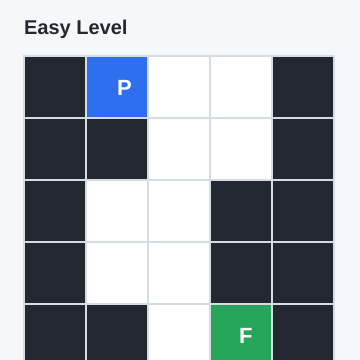
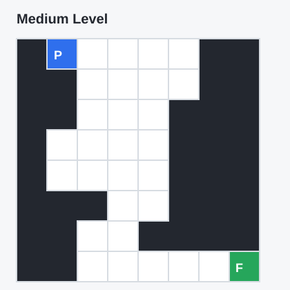
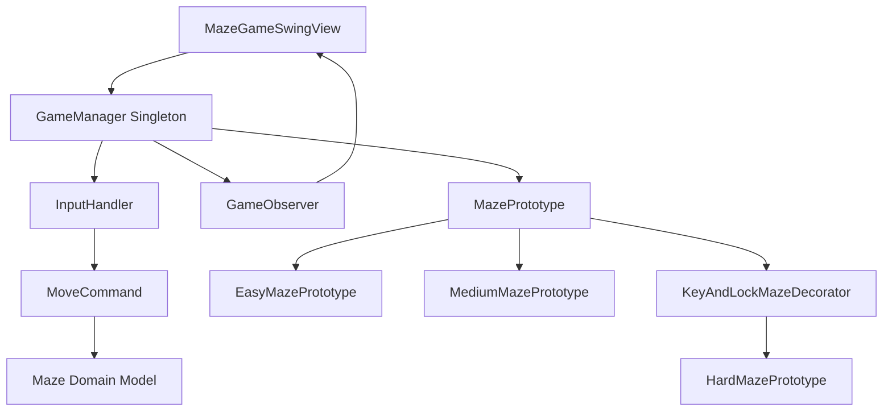

# Maze Collapse - Design Patterns Java

Maze Collapse is a Java Swing puzzle game built to demonstrate object-oriented design, clean architecture, and practical use of design patterns. The player navigates a maze, avoids invalid moves, collects keys when required, unlocks blocked paths, and reaches the finish only after visiting all required cells.

The project uses a standard Maven structure, separates game logic from the Swing UI, and includes JUnit 5 tests for the core gameplay rules. It demonstrates five design patterns: Singleton, Observer, Command, Decorator, and Prototype.

## Features

- Three difficulty levels: Easy, Medium, and Hard.
- Swing desktop interface with keyboard controls.
- Maze rules implemented in a reusable domain model.
- Key and lock mechanic for the Hard level.
- Design patterns used in runtime, not only as package names.

## Game Rules

- Choose a difficulty level from the top buttons.
- Move the player with the arrow keys.
- The player may move only through valid path cells.
- Moving into a wall, locked cell, already visited cell, or outside the maze ends the attempt.
- Visited cells collapse and cannot be reused.
- On Hard difficulty, the player must collect the key before passing through the locked path.
- The level is completed correctly only if the player reaches the finish after visiting all required cells.

## Screenshots

Representative board previews:





Current Hard level layout:

```text
##########
#P....####
#####.#..#
###...#..#
###......#
#####....#
##....####
##..#F...#
###......#
##########
```

## How to Run

Requirements:

- Java 17 or newer
- Maven 3.8+ recommended

Run with Maven:

```bash
mvn clean compile exec:java
```

Run the JUnit 5 test suite:

```bash
mvn test
```

Compile manually without Maven:

```bash
javac -d out $(find src/main/java -name "*.java")
java -cp out mazecollapse.Main
```

On Windows PowerShell:

```powershell
$files = Get-ChildItem -Recurse -Filter *.java src\main\java | ForEach-Object { $_.FullName }
javac -d out $files
java -cp out mazecollapse.Main
```

## Design Patterns Used

### Singleton

`GameManager` is implemented as a thread-safe singleton using the initialization-on-demand holder idiom. It coordinates the current maze, selected difficulty, command input, and game observers.

Why it fits: the game has one active runtime coordinator shared by the UI and game flow.

### Command

Movement is encapsulated through the `Command` interface and `MoveCommand`. `InputHandler` maps each `Direction` to a command.

Why it fits: player actions are represented as reusable objects, making input handling independent from the UI.

### Observer

The deprecated Java `Observable` API was replaced with a custom `GameObserver` interface. The Swing view subscribes to `GameManager` and reacts to `GameEvent` updates.

Why it fits: the game state can notify UI or other listeners without depending on Swing classes.

### Prototype

Each difficulty level is represented as a `MazePrototype`. A prototype stores a template maze and returns a cloned maze for every new game.

Why it fits: restarting or changing levels creates fresh maze instances without rebuilding all cell data manually.

### Decorator

`KeyAndLockMazeDecorator` wraps a base `MazePrototype` and adds key/lock mechanics to the Hard level.

Why it fits: extra behavior is added to a specific level without changing the base hard maze prototype.

## Architecture



## Project Structure

```text
src/main/java/mazecollapse
+-- command      # Command pattern for player moves
+-- decorator    # Decorator pattern for key/lock level extension
+-- model        # Core game model and rules
+-- observer     # Custom observer contract and events
+-- prototype    # Maze prototypes for difficulty levels
+-- singleton    # GameManager singleton
+-- view         # Swing UI
```

## Refactoring Highlights

- Reorganized the project into a standard Maven structure.
- Removed IDE files, compiled classes, and generated artifacts from version control.
- Separated domain logic from the Swing user interface.
- Replaced magic numbers with enums for cells, directions, and difficulty levels.
- Replaced deprecated observer APIs with a custom observer interface.
- Added JUnit 5 tests for movement, level completion, prototype cloning, game manager behavior, and key/lock mechanics.
- Added GitHub-ready documentation and visual board previews.

## What I Learned

- How to separate UI code from game rules so the model can be tested independently.
- How to use design patterns only where they solve a concrete problem.
- How to replace deprecated APIs with explicit project-owned abstractions.
- How repository structure affects how credible a project looks in an interview.
